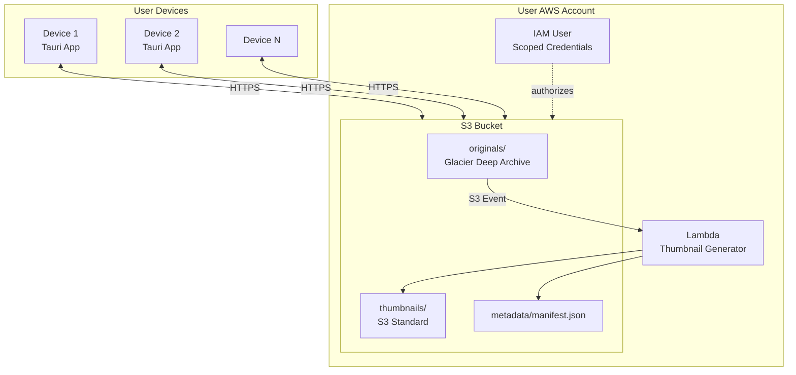
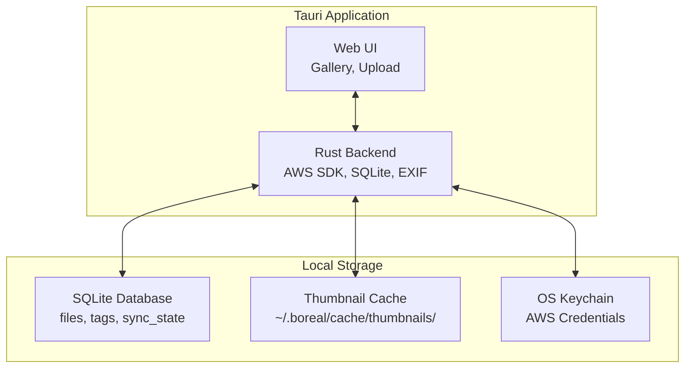
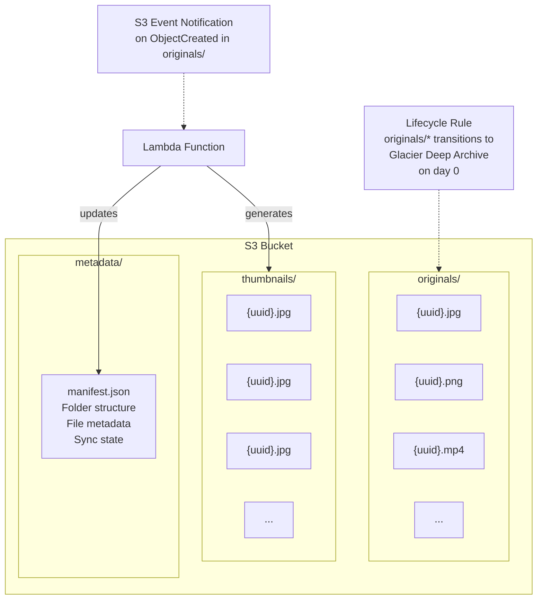
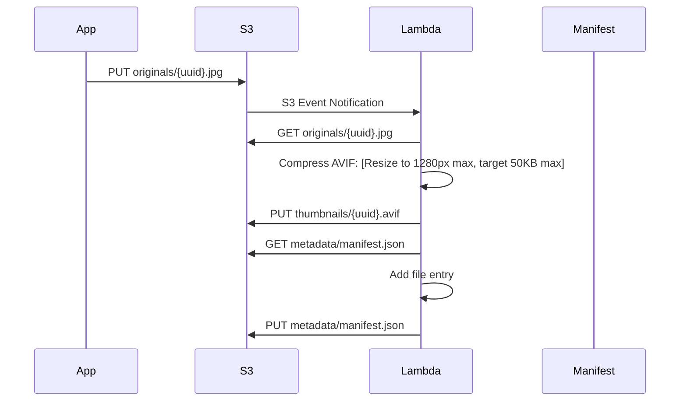
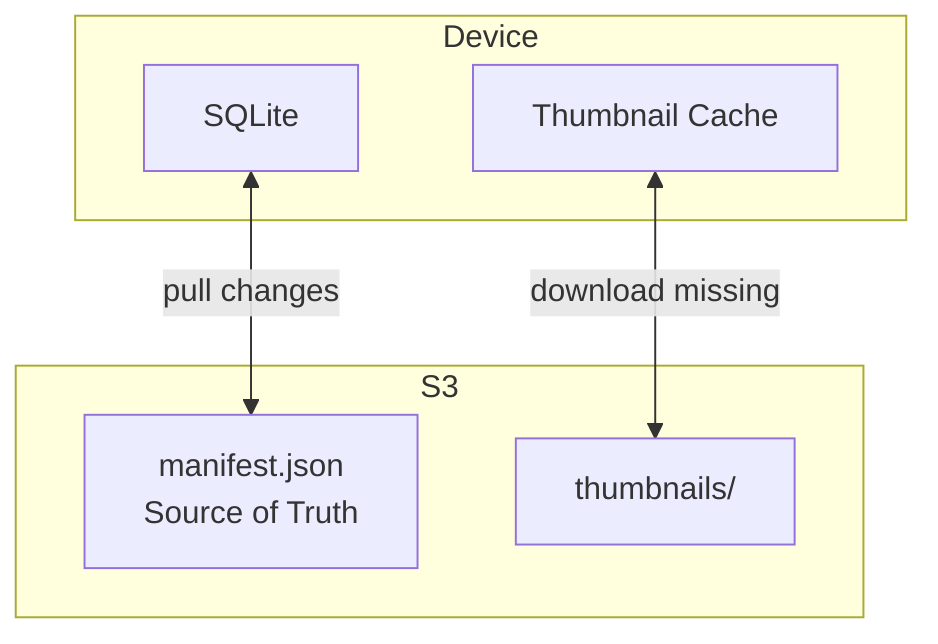
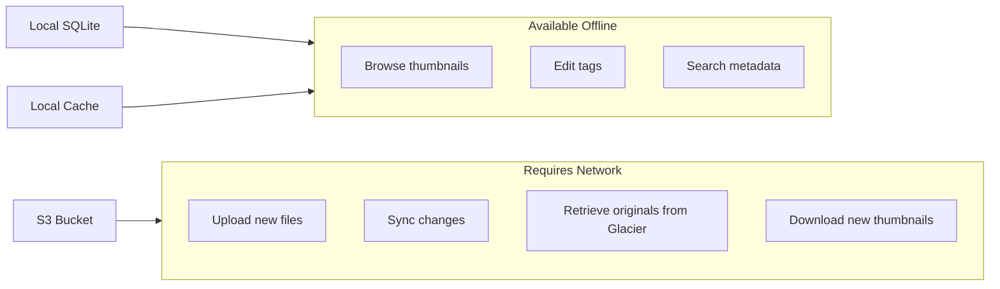

# Boreal

> Cold private storage, vivid memories.

*Most of the time, your memories rest quietly in the "boreal" cold. When you open an album, they light up like auroras on a dark sky.*

A privacy-first, self-hosted photo and video archival system. Users bring their own AWS account and storage. No servers, no subscriptions, no third-party access to your data.

**Boreal treats your S3 Bucket like a physical vault.** We automate the complex AWS infrastructure so you can simply manage your memories.

## Our Values: Privacy First, Always

**We believe your memories are yours and yours alone.** Boreal is built on the principle that privacy is not a feature—it's the foundation. Your data never passes through our servers, and all processing happens locally on your device.

> **Transparency Guarantee**: This is an open-source project. You can review every line of our code on this repository to verify that we prioritize your privacy above all else.

## Overview

Boreal is an application that enables users to store their photo and video libraries in their own AWS account. The system focuses on extreme privacy and decentralization by using **Physical Partitioning**: every album is a distinct cryptographic zone with its own access key, functioning like a digital USB drive that you can safely hand to someone.

### Core Principles

- **Privacy & Ownership**: You own the AWS account. You own the keys. We are just the interface.
- **Complete Decentralization**: No central servers, no tracking, no third-party access. Your data stays in your AWS account.
- **Physical Partitioning**: Sharing isn't a database flag; it's a cryptographic event. "Sharing an album" creates a specific AWS Key that can *only* open that specific folder.
- **Cost Flexibility**: Choose between deep cold storage `(~$1/TB)` or instant retrieval `(~$4/TB)` based on your needs.
- **Local Intelligence**: AI image search runs 100% on your device. No data is ever sent to the cloud for analysis.
- **Automated Complexity**: The app acts as your "Cloud Architect," automatically handling IAM users, policies, and S3 configuration so you never have to touch the AWS Console.

> **Important Disclaimer**: Boreal is an independent, open-source project and is not affiliated with any cloud provider. We use AWS for storage because they offer the most reliable, durable, and cost-effective cold storage solutions available today.

---

## Storage Classes: Cost vs. Convenience

Boreal allows you to choose your storage class. Each library uses a single storage class for all original files.

| Feature | **Glacier Deep Archive** (Default) | **Glacier Instant Retrieval** |
| :--- | :--- | :--- |
| **Best For** | Long-term archival, "Digital Attic" | Active libraries, "Cloud Drive" |
| **Monthly Cost** | **~$0.99 / TB** | **~$4.00 / TB** |
| **Thumbnail Access** | Instant | Instant |
| **Original File Access** | **12 - 48 Hours** (Restore required) | **Milliseconds** (Instant) |
| **Retrieval Cost** | Low ($0.0025/GB) | Higher ($0.03/GB) |
| **Min Storage Duration** | 180 days | 90 days |

*Note: Thumbnails and metadata are always stored in Standard S3 for instant browsing regardless of the tier chosen for originals.*

*For detailed storage architecture, see [Storage Architecture](./docs/StorageArchitecture.md). For complete cost analysis, see [Cost Analysis](./docs/CostAnalysis.md).*

---

## Architecture Overview

### System Overview

### Local Application Structure

Each device runs a self-contained Tauri application. All data is stored locally for offline operation.

### S3 Bucket Structure

Originals are transitioned immediately to Glacier Deep Archive via lifecycle rule. Thumbnails remain in S3 Standard for instant access. The manifest serves as the source of truth for multi-device sync.

### Thumbnail Generation Pipeline

When a file is uploaded, S3 triggers a Lambda function that generates a compressed thumbnail and updates the manifest.

### Multi-Device Sync

The manifest.json file in S3 serves as the source of truth. Each device maintains its own SQLite database and thumbnail cache, synchronized from the manifest.

### Offline Operation

After initial sync, the application functions fully offline using local SQLite and cached thumbnails.

---

## Vaults and Shared Albums

Boreal’s core model has two layers:

- **Vault**: A user-owned S3 bucket with a fixed layout (`originals/`, `thumbnails/`, `metadata/`). The Vault holds the full library manifest and all files. Each device syncs a Vault into a local SQLite database and thumbnail cache for offline use. An IAM user scoped to this bucket provides the necessary access. See [Vault](./concepts/Vault.md).

- **Shared Albums**: Read-only views into a subset of a Vault. A Shared Album is defined by a share manifest (`metadata/shares/<share-token>.json`) that lists allowed files and virtual folders. Guests use Boreal in “guest mode” with only a share token. A small Lambda (“Share Lambda”) reads the share manifest and issues short-lived presigned URLs for allowed files. See [Shared Albums](./concepts/SharedAlbum.md).

From the client’s perspective:
- The **Owner app** syncs the full Vault manifest and all thumbnails it needs.
- The **Guest app** syncs only the Shared Album manifest and thumbnails for that album.
- Both use the same local structures (SQLite + cache); the difference is only in scope and access path (IAM vs token + Lambda).

This design keeps the S3 layout simple, preserves strong access isolation, avoids IAM user sprawl, and preserves the offline-first, multi-device experience for both owners and guests.

---

## AI-Powered Search

Boreal includes a sophisticated local AI search system that understands your photos without compromising privacy.

### Key Features
- **Natural Language Queries**: "dog playing in snow" or "beach sunset"
- **Hybrid Search**: Combine AI understanding with metadata filters
- **Identity Recognition**: Search for specific people by name
- **100% Local**: All processing happens on your device

*For complete technical specifications and implementation details, see [AI Search](./features/ImageSearch.md)*

---

## User Onboarding & Setup

We prioritize a seamless "Magic Button" experience over manual configuration.

### 1. The "Architect" Setup
The first time you run the app, you provide a high-level AWS credential. The app uses this to become the "Architect," deploying a CloudFormation stack that sets up:
- The S3 Bucket with correct configuration
- The Lambda functions for thumbnail generation
- The base security policies

### 2. Day-to-Day Usage
The user creates albums, uploads files, and shares memories. The app silently manages the underlying AWS resources (copying objects, creating IAM users) in the background.

---

## Quick Cost Preview

| Storage Scenario | Monthly Cost |
|------------------|--------------|
| **1TB - Deep Archive** | ~$1.11 |
| **1TB - Instant Retrieval** | ~$4.12 |

*For detailed cost analysis with all storage classes and scenarios, see [Cost Analysis](./docs/CostAnalysis.md)*

---

## License

[MIT](./LICENSE)