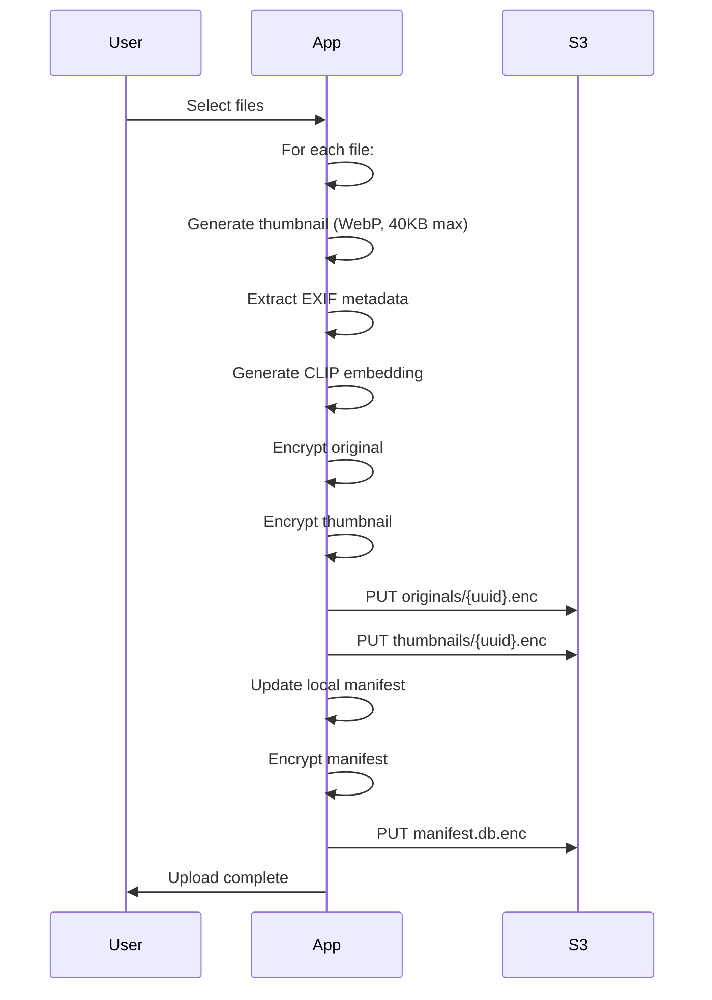
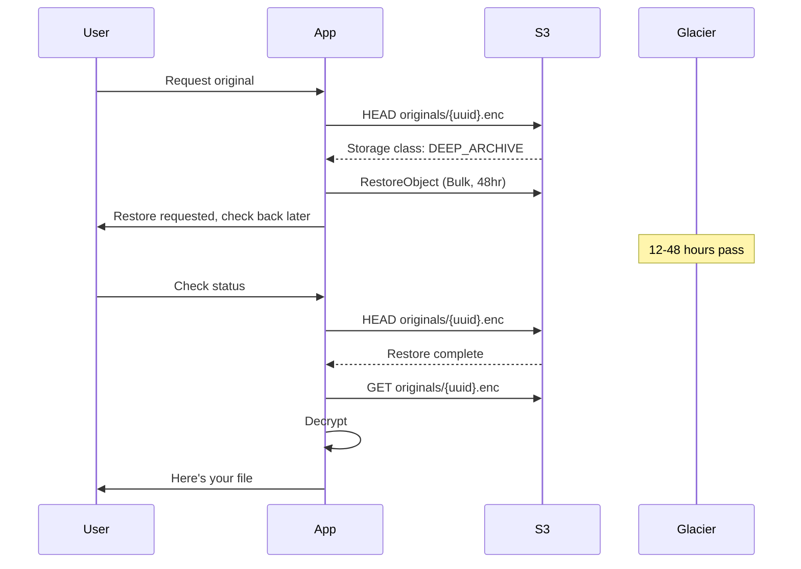

# Architecture

Boreal is three decoupled components:

1. **Bootstrap**: Terraform/CloudFormation that provisions AWS infrastructure
2. **Protocol**: How clients interact with a vault (S3 layout, encryption scheme)
3. **Clients**: Apps that implement the protocol

Anyone can build a client. You just need a vault file.

---

## Bootstrap

When you create a vault, the app opens AWS CloudFormation in your browser with a pre-configured template. CloudFormation creates:

- S3 bucket with lifecycle rules
- IAM user with scoped permissions
- Initial vault-key.enc (encrypted vault key)

The stack outputs a **Vault Code**—a base64-encoded vault file containing your credentials and KEK. Paste this into the app to complete setup.

---

## S3 Layout

```
boreal-vault-{id}/
├── vault-key.enc                   # KEK-encrypted vault key
├── originals/
│   └── {uuid}.enc                  # User chooses: Glacier IR or Deep Archive
├── thumbnails/
│   └── {uuid}.enc                  # S3 Standard
└── manifest.db.enc                 # Encrypted SQLite database
```

### Storage Tier Strategy

Originals are moved to Glacier by default for cost efficiency, but the user can choose between two options:

**Option 1: Deep Archive (Coldest)** — $0.99/TB/month
- Retrieval takes 12-48 hours
- Best for long-term archival, infrequent access
- Use bulk restore tier to minimize costs

**Option 2: Glacier Instant Retrieval (Balanced)** — $4.00/TB/month
- Retrieval is instant
- Best for active libraries where you may need quick access
- Still significantly cheaper than Standard ($23/TB/month)

### Lifecycle Rules for Cold Storage

**What's "Fresh Upload"?**
When you add new photos or videos to your Vault you may want to have the originals around for some flexible time before they get moved to cold storage. On the process of uploading if you toggle the "Fresh Upload" option, the originals will stay fresh or 2 months in S3 Standard storage, after that they transition to your chosen Glacier tier.

Thumbnails always stay in Standard for instant browsing.

---

## Manifest

The manifest is an encrypted SQLite database. It contains:

```sql
-- Files
CREATE TABLE files (
  id TEXT PRIMARY KEY,
  hash TEXT,
  filename TEXT,
  size INTEGER,
  mime_type TEXT,
  created_at TEXT,
  uploaded_at TEXT,
  width INTEGER,
  height INTEGER,
  duration_ms INTEGER,  -- for video/audio
  location_lat REAL,
  location_lng REAL,
  camera_make TEXT,
  camera_model TEXT
);

-- Full-text search
CREATE VIRTUAL TABLE files_fts USING fts5(
  filename, 
  content='files'
);

-- AI embeddings for semantic search
CREATE TABLE embeddings (
  file_id TEXT PRIMARY KEY,
  vector BLOB  -- 512-dim float32, 2KB per file
);

-- Memories (journal entries)
CREATE TABLE memories (
  id TEXT PRIMARY KEY,
  title TEXT,
  notes TEXT,
  date_start TEXT,
  date_end TEXT,
  location_lat REAL,
  location_lng REAL,
  created_at TEXT
);

CREATE TABLE memory_files (
  memory_id TEXT,
  file_id TEXT,
  PRIMARY KEY (memory_id, file_id)
);

-- Audio recordings in memories
CREATE TABLE audio (
  id TEXT PRIMARY KEY,
  memory_id TEXT,
  duration_ms INTEGER,
  transcript TEXT
);

-- Geo index for map view
CREATE VIRTUAL TABLE files_geo USING rtree(
  id,
  min_lat, max_lat,
  min_lng, max_lng
);
```

The manifest is the source of truth. Devices sync by pulling the latest manifest and merging.

---

## Client Architecture

```
┌─────────────────────────────────────────────────────────────┐
│  Tauri App                                                  │
│  ┌─────────────────────────────────────────────────────┐    │
│  │  Web UI (gallery, search, memories)                 │    │
│  └─────────────────────────────────────────────────────┘    │
│                           │                                 │
│                           │ IPC                             │
│                           ▼                                 │
│  ┌─────────────────────────────────────────────────────┐    │
│  │  Rust Core                                          │    │
│  │  - Encryption (libsodium / age)                     │    │
│  │  - S3 operations (aws-sdk-rust)                     │    │
│  │  - SQLite (rusqlite)                                │    │
│  │  - Thumbnail generation (image-rs)                  │    │
│  │  - EXIF extraction                                  │    │
│  │  - CLIP embeddings (ort / onnxruntime)              │    │
│  │  - Whisper transcription (whisper-rs)               │    │
│  └─────────────────────────────────────────────────────┘    │
│                           │                                 │
│                           ▼                                 │
│  ┌─────────────────────────────────────────────────────┐    │
│  │  Local Storage                                      │    │
│  │  - manifest.db (decrypted, local copy)              │    │
│  │  - thumbnails/ (decrypted cache)                    │    │
│  │  - vaults.json (list of known vaults)               │    │
│  │  - OS Keychain (vault files, optional)              │    │
│  └─────────────────────────────────────────────────────┘    │
└─────────────────────────────────────────────────────────────┘
```

---

## Sync Protocol

### Pull

```
1. GET manifest.db.enc from S3
2. Decrypt with vault key
3. Compare with local manifest
4. Merge changes (last-write-wins per record)
5. Download missing thumbnails
6. Decrypt and cache thumbnails locally
```

### Push

```
1. Encrypt local manifest with vault key
2. PUT manifest.db.enc to S3
```

For conflicts (rare, usually from simultaneous edits on two devices), the app shows both versions and lets the user choose.

---

## Upload Flow



---

## Retrieval Flow (Deep Archive)



---

## Offline Capability

After initial sync, these work offline:

- Browse all thumbnails
- Search by metadata, text, AI embeddings
- View memories
- Edit tags and notes
- Create new memories

These require network:

- Upload new files
- Sync changes to/from S3
- Retrieve originals from Glacier
- Download thumbnails not yet cached

---

## Search

All search is local.

**Metadata**: SQLite queries on dates, locations, camera, dimensions.

**Text**: FTS5 on filenames, memory notes, audio transcripts.

**AI**: Analyzes input for semantic search, image classification. Details on [Image Search](./ImageSearch.md).

**Geo**: R-tree index for "photos near this point" queries.

No API calls. No data leaves your device for search.