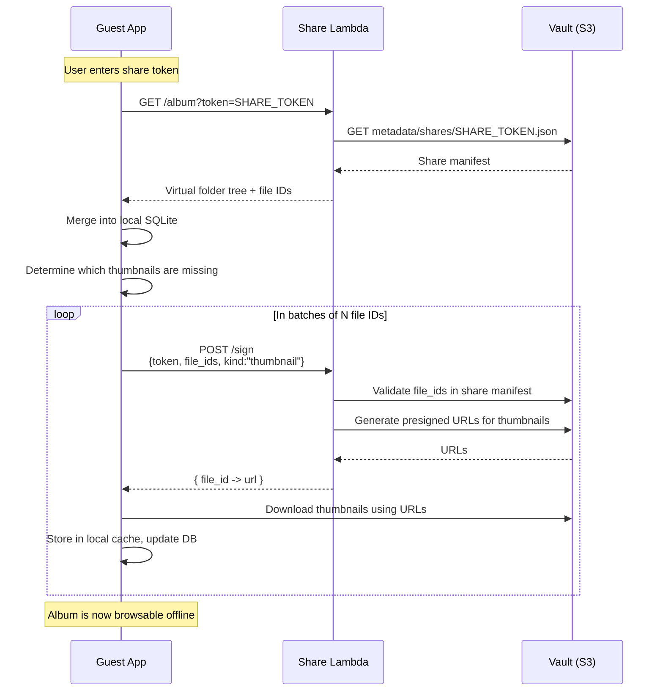

# Shared Albums

Shared Albums allow you to give other people read-only access to a subset of your Vault without giving them AWS credentials or exposing the rest of your library.

A Shared Album is defined as:

- A **virtual subtree** of your library (one node in the Vault’s folder tree and all its descendants)
- A **share token** (opaque string) that represents this subtree
- A **share manifest** stored in S3 mapping that token to files and folders
- A **Share Lambda** that enforces access and issues short-lived URLs

## Data Model

Shared Albums do not move or duplicate files in S3. They are views derived from the Vault metadata.

```text
s3://<vault-bucket>/
  originals/
    <uuid>
  thumbnails/
    <uuid>
  metadata/
    manifest.json            # Full library (owner)
    shares/
      <share-token>.json     # One per shared album
```

`metadata/shares/<share-token>.json` contains:

- A reference name (e.g., "Summer Trip 2024")
- A virtual folder tree for the shared subtree
- A list of allowed file IDs (UUIDs) within that subtree
- Optional metadata (created_at, owner notes)

## Shared Albums Architecture

```mermaid
flowchart TB
    subgraph OwnerAWS["Owner AWS Account"]
        subgraph Vault["Vault (S3 Bucket)"]
            M["metadata/manifest.json"]
            MS["metadata/shares/<share-token>.json"]
            TO["thumbnails/<uuid>"]
            OO["originals/<uuid>"]
        end

        ShareLambda["Share Lambda<br>(Keymaster API)"]
    end

    subgraph OwnerDevice["Owner Device"]
        OwnerApp["Boreal App<br>(Owner Mode)"]
    end

    subgraph GuestDevice["Guest Device"]
        GuestApp["Boreal App<br>(Guest Mode)"]
    end

    OwnerApp <-->|AWS SDK (IAM creds)| Vault
    OwnerApp -->|Create share-token manifest| MS

    GuestApp -->|HTTPS (token-based)| ShareLambda
    ShareLambda -->|Read share manifest| MS
    ShareLambda -->|Generate presigned URLs| Vault
    GuestApp -->|Download via signed URLs| Vault
```

## Share Creation Flow (Owner)

1. Owner selects a folder (virtual album) in their local app.
2. App resolves that subtree into a set of file IDs and folder structure.
3. App generates a random share token (e.g. UUID).
4. App writes `metadata/shares/<share-token>.json` into the Vault bucket.
5. App presents the share token (or encoded share link) to the owner to distribute.

## Guest Access Flow

The guest uses Boreal in “guest mode” with only a share token; they do not need an AWS account.

### Sync and Browse



The Guest app stores:

- A local SQLite subtree for that Shared Album
- A local thumbnail cache for those files

It behaves like a read-only Vault rooted at that album.

## Revocation

To revoke a Shared Album:

1. Owner selects the share in their app and clicks “Revoke”.
2. App deletes `metadata/shares/<share-token>.json` from S3.
3. On next Guest sync:
   - `GET /album?token=SHARE_TOKEN` fails (404 / 403).
   - Guest app marks the Shared Album as revoked and stops further access.

No IAM users or additional AWS accounts are involved. Access is enforced entirely by:

- The existence and contents of `metadata/shares/<share-token>.json`
- The Share Lambda, which:
  - Only signs URLs for files that appear in the share manifest
  - Refuses requests for unknown or revoked tokens
