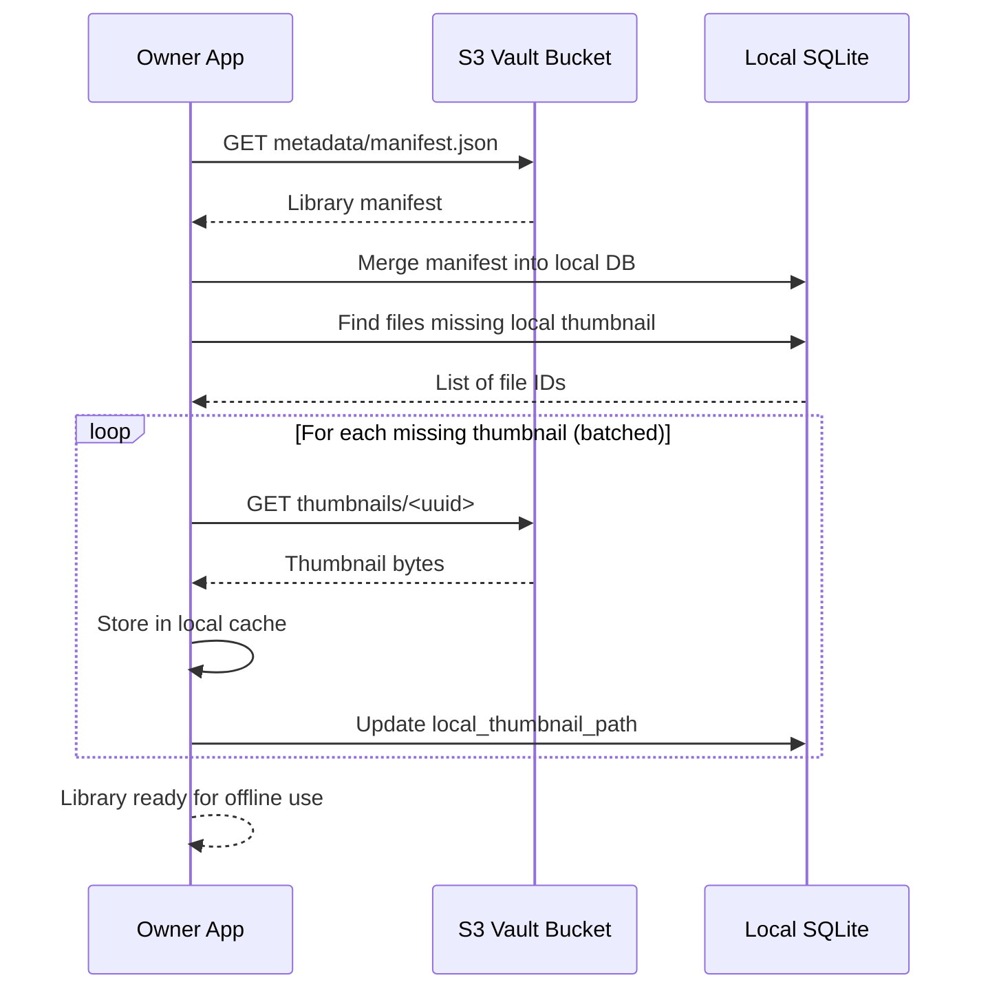

# Vault

A **Vault** is the unit of storage Boreal manages in your AWS account. In practice, a Vault is:

- A single S3 bucket with a fixed internal layout
- One IAM user with scoped permissions to that bucket
- One or more local clients (devices) that sync against it

Boreal treats the Vault as the source of truth for your library metadata and files.

## S3 Layout

The S3 bucket for a Vault has a simple, flat layout. All higher-level concepts (albums, folders, tags) are represented in metadata, not in S3 paths.

```text
s3://<vault-bucket>/
  originals/                # Full-resolution files (photos, videos)
    <uuid>                  # Object keys based on internal ID
    ...

  thumbnails/               # Compressed thumbnails for browsing
    <uuid>

  metadata/
    manifest.json           # Full library manifest (files, virtual folders)
    shares/
      <share-token>.json    # Per-share album manifests (used by Shared Albums)
```

### Storage Classes

- `originals/*` are immediately transitioned to Glacier Deep Archive or Glacier Instant Retrieval via lifecycle rules (based on Vault configuration).
- `thumbnails/*` and `metadata/*` remain in S3 Standard for instant access.

## Vault Architecture

```mermaid
flowchart TB
    subgraph Devices["Owner Devices"]
        D1["Device 1<br>Tauri App"]
        D2["Device 2<br>Tauri App"]
    end

    subgraph AWS["AWS (Owner Account)"]
        subgraph S3["S3 Vault Bucket"]
            O["originals/<br>Glacier class"]
            T["thumbnails/<br>S3 Standard"]
            M["metadata/manifest.json"]
            MS["metadata/shares/<br>share-token manifests"]
        end

        Lthumb["Lambda<br>Thumbnail Generator"]
        IAMUser["IAM User<br>Scoped to this bucket"]
    end

    D1 <-->|HTTPS (AWS SDK)| S3
    D2 <-->|HTTPS (AWS SDK)| S3

    O -->|ObjectCreated Event| Lthumb
    Lthumb --> T
    Lthumb --> M

    IAMUser -.->|credentials stored in OS keychain| D1
    IAMUser -.->|credentials stored in OS keychain| D2
```

### Permissions Model (Vault Level)

The IAM user created for the Vault has minimal permissions:

- `s3:PutObject` on `originals/*`
- `s3:GetObject` on `thumbnails/*`, `metadata/*`
- `s3:ListBucket` on this bucket
- `s3:RestoreObject` on `originals/*` (for Glacier restore)

It cannot access other buckets or AWS services. These credentials are stored on each device in the OS keychain.

## Local Representation

On each device, the Vault is represented by:

- A local SQLite database:
  - File records (IDs, metadata, S3 keys)
  - Virtual folder tree (albums, subfolders)
  - Tags and sync state
- A thumbnail cache on disk:
  - Local copies of thumbnails for offline browsing

### Owner Sync Flow



The same Vault can be synced on multiple devices. All of them treat the Vault manifest as the authoritative view of the library.